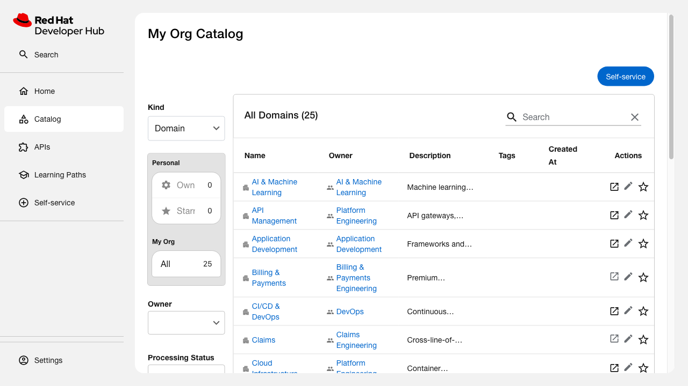

# Catalog Entities Demo

*2026-04-28T11:26:28Z by Showboat 0.6.1*
<!-- showboat-id: 423f0aa2-e148-49c4-8005-511aabdf9030 -->

Spec: [catalog-entities/spec.md](spec.md)
Change: simulated-enterprise-catalog
Instance: rhdh-local-cookbook (<http://localhost:7007>)

## AC: All catalog layers load in a single Backstage instance

Enterprise OSS + Parasol Insurance + TechDocs + Templates all loaded via URL and file references.

```bash
curl -s 'http://localhost:7007/api/catalog/entities?filter=kind=Location' | jq '[.[] | .metadata.name] | sort'
```

```output
[
  "enterprise-catalog-index",
  "generated-17191094f7ae325f445117d3619164fa0c9d4df4",
  "generated-17a8e1a3eb335b582502c9a3daffd38287eb7180",
  "generated-28da968db19ca0a1df7f1b7730583a50219e7081",
  "generated-2de147757895936b92e8da87d37f6fd4bf317550",
  "generated-35ce02ee42b76fca6327cca4ff26ef5edc14f63b",
  "generated-3a9a5b1cbaaa81fc71ae6905a0a2df34a9a73fc0",
  "generated-4964e9e17fc74c263e04ff8fb488316e50a5b69f",
  "generated-75beb3bd6b2b13564fa54f3c8a79747b22ac005c",
  "generated-a17abbbadfccd5e8d0d822b6a78b039cf9c477a2",
  "generated-a977a4eabdcc3f2c63eb87560a24f26e5e8675d0",
  "generated-ab39a9ef5ca7b8e0d12ba20528313dc6e172bca6",
  "generated-ab9146618718de88616deb4d9cff3128285e1d7f",
  "generated-ea9f38bce9b6175390716bca2273e96b82cf104b",
  "generated-fea3056ba9558e792fb3056caf8bb455bd757e25"
]
```

## AC: Entity breadth — Parasol provides expected counts

Filtering for Parasol-specific entities (by matching domain owner groups).

```bash
echo '=== Parasol Entity Counts ===' && echo "Groups: $(curl -s 'http://localhost:7007/api/catalog/entities?filter=kind=Group' | jq '[.[] | select(.metadata.name | test("claims|underwriting|digital|policy|billing|reinsurance|data-analytics|personal|commercial|specialty|life|compliance|parasol"))] | length')" && echo "Domains: $(curl -s 'http://localhost:7007/api/catalog/entities?filter=kind=Domain' | jq '[.[] | select(.spec.owner | test("parasol|claims|underwriting|digital|policy|billing|reinsurance|data-analytics|personal|commercial|specialty|life|compliance"))] | length')" && echo "Systems: $(curl -s 'http://localhost:7007/api/catalog/entities?filter=kind=System' | jq '[.[] | select(.spec.owner | test("claims|underwriting|digital|policy|billing|reinsurance|data-analytics|personal|commercial|specialty|life|compliance|parasol"))] | length')" && echo "Components: $(curl -s 'http://localhost:7007/api/catalog/entities?filter=kind=Component' | jq '[.[] | select(.spec.owner | test("claims|underwriting|digital|policy|billing|reinsurance|data-analytics|personal|commercial|specialty|life|compliance|parasol"))] | length')" && echo "APIs: $(curl -s 'http://localhost:7007/api/catalog/entities?filter=kind=API' | jq '[.[] | select(.spec.owner | test("claims|underwriting|digital|policy|billing|reinsurance|data-analytics|personal|commercial|specialty|life|compliance|parasol"))] | length')"
```

```output
=== Parasol Entity Counts ===
Groups: 13
Domains: 14
Systems: 53
Components: 175
APIs: 16
```

## AC: Domain hierarchy is complete

Every System declares a domain, every Component declares a system, every entity declares an owner.

```bash
echo '=== Systems without domain ===' && curl -s 'http://localhost:7007/api/catalog/entities?filter=kind=System' | jq '[.[] | select(.spec.owner | test("claims|underwriting|digital|policy|billing|reinsurance|data-analytics|personal|commercial|specialty|life|compliance|parasol")) | select(.spec.domain == null)] | length' && echo '=== Components without system ===' && curl -s 'http://localhost:7007/api/catalog/entities?filter=kind=Component' | jq '[.[] | select(.spec.owner | test("claims|underwriting|digital|policy|billing|reinsurance|data-analytics|personal|commercial|specialty|life|compliance|parasol")) | select(.spec.system == null)] | length' && echo '=== Entities without owner ===' && curl -s 'http://localhost:7007/api/catalog/entities?filter=kind=Component' | jq '[.[] | select(.spec.owner | test("claims|underwriting|digital|policy|billing|reinsurance|data-analytics|personal|commercial|specialty|life|compliance|parasol")) | select(.spec.owner == null)] | length'
```

```output
=== Systems without domain ===
0
=== Components without system ===
0
=== Entities without owner ===
0
```

## AC: Component metadata completeness

Sample a component (fnol-intake-service) and verify it has description, tags, owner, system, and relationships.

```bash
curl -s 'http://localhost:7007/api/catalog/entities?filter=kind=Component,metadata.name=fnol-intake-service' | jq '.[0] | {
  name: .metadata.name,
  has_description: (.metadata.description != null),
  tags: .metadata.tags,
  owner: .spec.owner,
  system: .spec.system,
  relations: [.relations[] | .type] | unique
}'
```

```output
{
  "name": "fnol-intake-service",
  "has_description": true,
  "tags": [
    "claims",
    "fnol",
    "java",
    "rest"
  ],
  "owner": "group:default/claims-engineering",
  "system": "fnol-system",
  "relations": [
    "dependencyOf",
    "dependsOn",
    "ownedBy",
    "partOf"
  ]
}
```

## AC: Graph traversal from any service component

Traverse from fnol-intake-service → owning team → domain → cross-domain dependencies.

```bash
echo '=== Traversal: fnol-intake-service ===' && echo 'Owner:' && curl -s 'http://localhost:7007/api/catalog/entities?filter=kind=Component,metadata.name=fnol-intake-service' | jq -r '.[0].spec.owner' && echo 'System:' && curl -s 'http://localhost:7007/api/catalog/entities?filter=kind=Component,metadata.name=fnol-intake-service' | jq -r '.[0].spec.system' && echo 'Domain (via system):' && curl -s 'http://localhost:7007/api/catalog/entities?filter=kind=System,metadata.name=fnol-system' | jq -r '.[0].spec.domain' && echo 'Dependencies (cross-domain):' && curl -s 'http://localhost:7007/api/catalog/entities?filter=kind=Component,metadata.name=fnol-intake-service' | jq '[.[0].relations[] | select(.type=="dependsOn") | .targetRef]'
```

```output
=== Traversal: fnol-intake-service ===
Owner:
group:default/claims-engineering
System:
fnol-system
Domain (via system):
claims
Dependencies (cross-domain):
[
  "component:default/policy-coverage-query-service",
  "component:default/policy-search-index-service"
]
```

## Catalog UI — Domains view

```bash {image}

```


