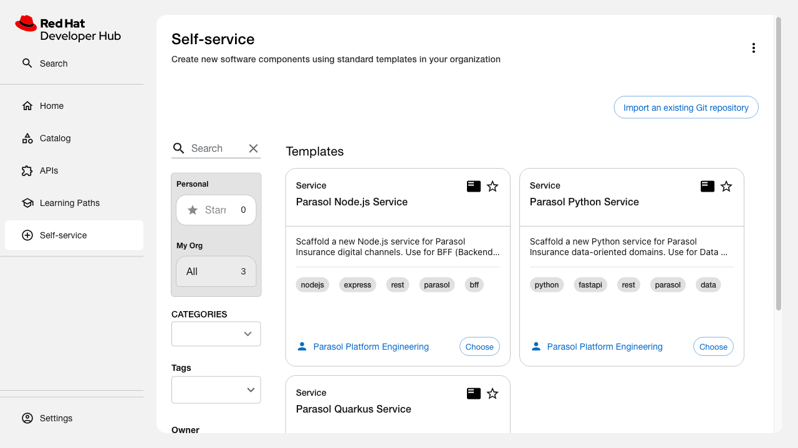

# Software Templates Demo

*2026-04-28T11:28:21Z by Showboat 0.6.1*
<!-- showboat-id: bf813bcc-bbb6-442d-9ed9-18b3199f727a -->

Spec: [software-templates/spec.md](spec.md)
Change: simulated-enterprise-catalog
Instance: rhdh-local-cookbook (<http://localhost:7007>)

## AC: Template inventory — 3 templates covering Java, Python, Node.js

```bash
curl -s 'http://localhost:7007/api/catalog/entities?filter=kind=Template' | jq '[.[] | {name: .metadata.name, title: .metadata.title, tags: .metadata.tags, description: .metadata.description}]'
```

```output
[
  {
    "name": "parasol-nodejs-service",
    "title": "Parasol Node.js Service",
    "tags": [
      "nodejs",
      "express",
      "rest",
      "parasol",
      "bff"
    ],
    "description": "Scaffold a new Node.js service for Parasol Insurance digital channels.\nUse for BFF (Backend-for-Frontend) services, push notification handlers,\nreal-time messaging, and broker portal APIs. Produces an Express.js project\nwith health checks, Prometheus metrics, OpenTelemetry tracing, and a valid\ncatalog-info.yaml.\n"
  },
  {
    "name": "parasol-quarkus-service",
    "title": "Parasol Quarkus Service",
    "tags": [
      "java",
      "quarkus",
      "rest",
      "parasol",
      "recommended"
    ],
    "description": "Scaffold a new Quarkus microservice for Parasol Insurance domains.\nUse for Claims, Underwriting, Policy Administration, Billing, and other\nJava-dominant domains. Produces a Maven project with REST endpoint,\nhealth checks, metrics, and a valid catalog-info.yaml.\n"
  },
  {
    "name": "parasol-python-service",
    "title": "Parasol Python Service",
    "tags": [
      "python",
      "fastapi",
      "rest",
      "parasol",
      "data"
    ],
    "description": "Scaffold a new Python service for Parasol Insurance data-oriented domains.\nUse for Data & Analytics, ML pipelines, and actuarial workloads. Produces\na FastAPI project with health checks, Prometheus metrics, OpenTelemetry\ntracing, and a valid catalog-info.yaml.\n"
  }
]
```

## AC: Agent selects correct template

Each template's description and tags map to specific Parasol domains. An agent can match:

- Claims/Underwriting/Policy/Billing → parasol-quarkus-service (tag: java, recommended)
- Data & Analytics / ML → parasol-python-service (tag: python, data)
- Customer Portal / Digital → parasol-nodejs-service (tag: nodejs, bff)

## AC: Required parameters present

Every template collects service name (kebab-case), description, owner (Group picker), and system (System picker).

```bash
for tpl in parasol-quarkus-service parasol-python-service parasol-nodejs-service; do
  echo "=== $tpl ==="
  curl -s "http://localhost:7007/api/catalog/entities?filter=kind=Template,metadata.name=$tpl" | jq '.[0].spec.parameters[0].required'
done
```

```output
=== parasol-quarkus-service ===
[
  "name",
  "description",
  "owner",
  "system"
]
=== parasol-python-service ===
[
  "name",
  "description",
  "owner",
  "system"
]
=== parasol-nodejs-service ===
[
  "name",
  "description",
  "owner",
  "system"
]
```

All 3 templates require the same base parameters: name, description, owner, system.

## AC: Generated catalog-info.yaml is valid

The shared skeleton produces catalog-info.yaml with correct entity references.

```bash
cat /workspace/rhdh-agentic/catalog/templates/skeletons/catalog-info/catalog-info.yaml
```

```output
apiVersion: backstage.io/v1alpha1
kind: Component
metadata:
  name: ${{ values.name }}
  description: ${{ values.description }}
  annotations:
    backstage.io/techdocs-ref: dir:.
  tags:
    - ${{ values.stack }}

    - ${{ values.domain }}

spec:
  type: service
  lifecycle: production
  owner: ${{ values.owner }}
  system: ${{ values.system }}

  dependsOn:
    - ${{ values.dependsOn }}

```

## Templates in the RHDH Self-service section

```bash {image}

```


